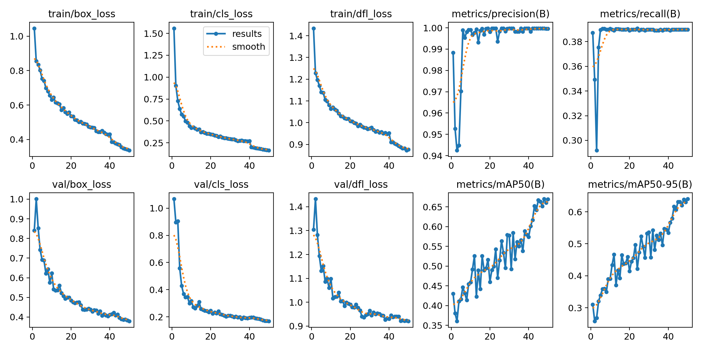

# FYP Repository

## Introduction
This repository contains the code and resources for a Final Year Project focused on live facial detection using the YOLOv8 model. It includes various scripts and Jupyter Notebooks for data processing, model training, and testing.

## File Descriptions
- **Main.ipynb**: Implements YOLOv8 model for live facial detection.
- **Data Classify.ipynb**: Code for classifying data.
- **SplitData.ipynb**: Script for splitting data into training and testing sets.
- **Train.ipynb**: Contains model training code.
- **ModuleTesting.ipynb**: Tests different modules.
- **frame_extract.ipynb**: Script for extracting frames from video.
- **requirements.txt**: Lists the dependencies required to run the project.

## Setup Instructions
1. Clone the repository.
2. Install the dependencies using `pip install -r requirements.txt`.
3. Run the Jupyter Notebooks as needed to process data, train the model, or test facial detection.

## Usage
- Ensure you have a webcam connected for live facial detection.
- Open and run `Main.ipynb` to start the live facial detection process.

*Figure 1: Model accuracy visualization.*

*Figure 2: Training batch 6522.*

*Figure 3: Test Real.*

*Figure 3: Test Fake.*

